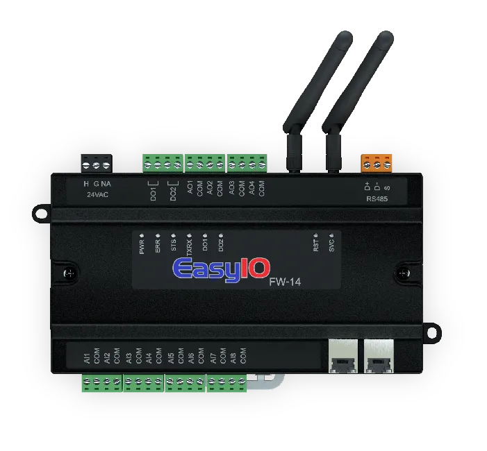
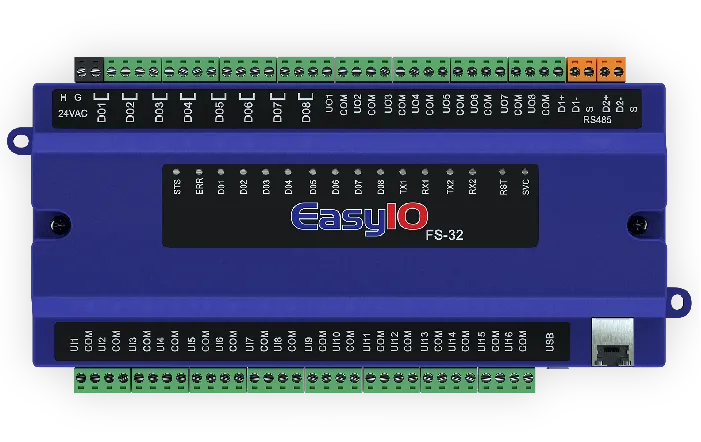
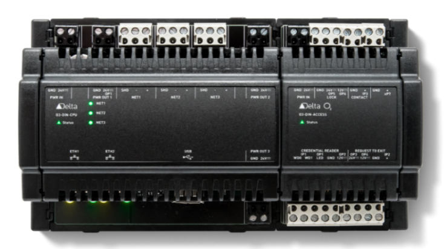
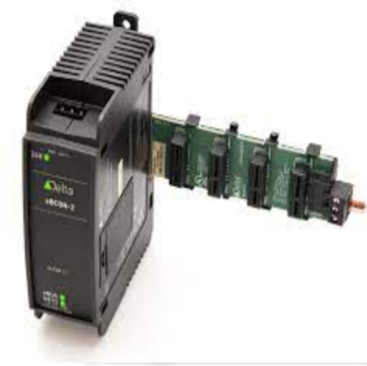
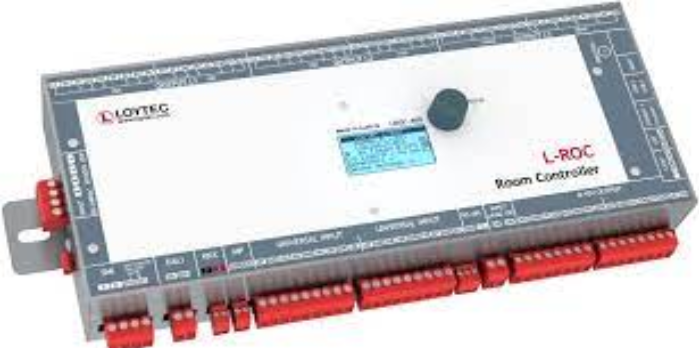
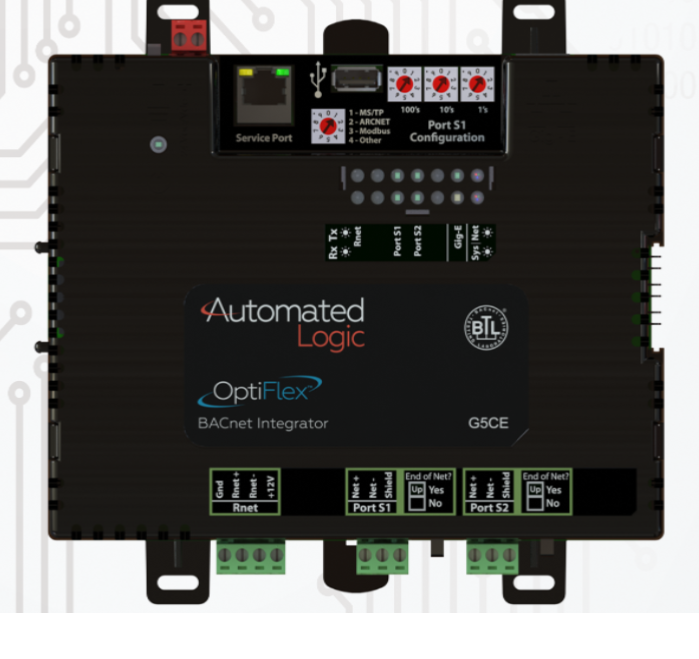

- Date: 2024/02/27, 17:49:33
- UDMI version: 1.5.0-16-g48397c75b

## UDMI test results for direct and gateway devices

| Bucket | Feature | Stage | DDC&#x2011;1 | DDC&#x2011;9 | DDC&#x2011;3 | DDC&#x2011;4 | DDC&#x2011;5 | DDC&#x2011;10 | DDC&#x2011;12 |
| --- | --- | --- | --- | --- | --- | --- | --- | --- | --- |
| image| | | |  |  |  |  |  |  |
| make| | | JCI | JCI | Delta Controls Inc. | Delta Controls | RadixIoT | LOYTEC electronics | Automated Logic Corporation |
| model| | | FW14/08/28 | FS32/20 | O3&#x2011;DIN&#x2011;CPU | eBCON&#x2011;2 | Mango | LROC&#x2011;400 | OFHI |
| firmware| | | v1.0b23_GS | V3.0b61a_GS | 4.13.1.1017 (4130-001) | 4.14.0.2116 (4141-001) | 5.1.1-beta.2 | 8.2.0 | 108.04.20021 |
| test_date| | | 2024&#x2011;02&#x2011;14T09:12:47Z | 2024&#x2011;02&#x2011;15T14:00:51Z | 2024&#x2011;02&#x2011;26T13:46:12Z | 2024&#x2011;02&#x2011;15T16:17:51Z | 2024&#x2011;02&#x2011;12T09:02:59Z | 2024&#x2011;01&#x2011;30T19:02:54Z | 2024&#x2011;02&#x2011;28T17:08:52Z |
| manual | is_iotcore_gateway | beta ||||||||
| manual | udmi.native | beta ||||||||
| manual | endpoint.manual | beta ||||||||
| manual | endpoint.clearblade_connected | beta ||||||||
| manual | endpoint.mqtt.mqtt_311 | beta ||||||||
| manual | endpoint.mqtt.mqtt_tls | beta ||||||||
| manual | endpoint.mqtt.mqtt_sustained | beta ||||||||
| manual | endpoint.mqtt.mqtt_reconnect | beta ||||||||
| manual | endpoint.mqtt.mqtt_exponential_backoff | beta ||||||||
| manual | endpoint.mqtt.mqtt_auth_jwt | beta ||||||||
| manual | datapoint_mapping | beta ||||||||
| manual | time_utc_format | beta ||||||||
| pointset | pointset_publish | beta |  |  |  |  |  || |
| pointset | pointset_publish_interval | beta |  ||  ||  | ||
| pointset | pointset_remove_point | beta |  ||  ||  |||
| pointset | pointset_request_extraneous | beta |  ||  ||  |||
| pointset | pointset_sample_rate | beta |  ||  ||  |||
| system | broken_config | beta |  ||  ||  |||
| system | config_logging.receive | beta |  | |  ||  |||
| system | config_logging.parse | beta |  | |  ||  |||
| system | config_logging.apply | beta |  ||  ||  |||
| system | device_config_acked | beta |  ||  ||  |||
| system | extra_config | beta |  ||  ||  |||
| system | state_make_model | beta |  ||  ||  |||
| system | state_software | beta |  ||  ||  |||
| system | system_last_update | beta |  ||  ||  |||
| system | valid_serial_no | beta |  ||  ||  |||
| unknown | family_ether_addr | beta |  || ||  |||
| unknown | family_ipv4_addr | beta |  || ||  |||
| notes |  |  |  |  |  |  |  |  |  |
