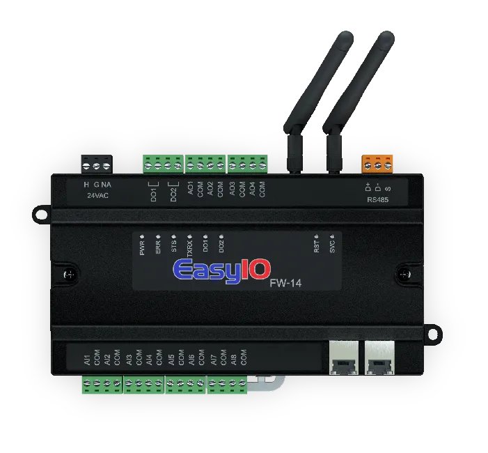
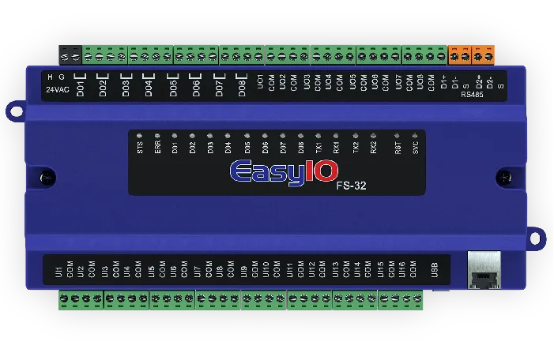
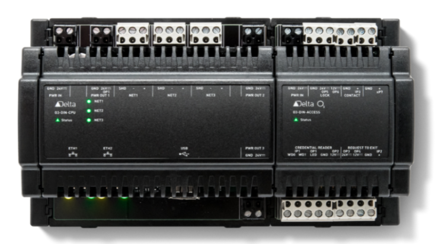
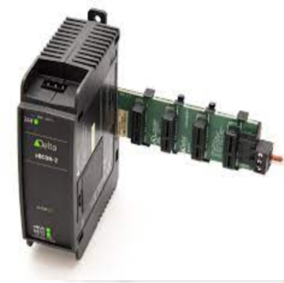
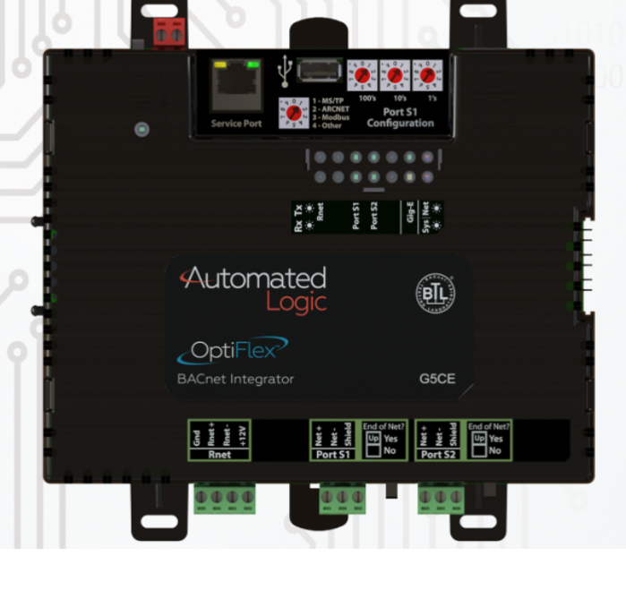

- Date: 2024/02/27, 17:49:34
- UDMI version: 1.5.0-16-g48397c75b

## UDMI test results for proxied devices

| Bucket | Feature | Stage | TEST&#x2011;101 | TEST&#x2011;901 | TEST&#x2011;301 | TEST&#x2011;401 | TEST&#x2011;501 | TEST&#x2011;121 | 
| --- | --- | --- | --- | --- | --- | --- | --- | --- |
| image| | | |  |  |  |  |  |
| make| | | JCI | JCI | Delta Controls Inc. | Delta Controls | RadixIoT | Automated Logic Corporation |
| model| | | FW14/08/28 | FS32/20 | O3&#x2011;DIN&#x2011;CPU | eBCON&#x2011;2 | Mango |OFHI |
| firmware| | | v1.0b23_GS | V3.0b61a_GS | 4.13.1.1017 (4130-001) | 4.14.0.2116 (4141-001) | 5.1.1-beta.2 | 108.04.20021 |
| test_date| | | 2024&#x2011;02&#x2011;14T09:12:47Z | 2024&#x2011;02&#x2011;15T14:00:51Z | 2024&#x2011;02&#x2011;26T13:46:12Z | 2024&#x2011;02&#x2011;15T16:17:51Z | 2024&#x2011;02&#x2011;12T09:02:59Z | 2024&#x2011;02&#x2011;28T17:08:52Z |
| manual | datapoint_mapping | beta |||||||
| manual | time_utc_format | beta |||||||
| pointset | pointset_publish | beta |  | |  | | |   |
| pointset | pointset_publish_interval | beta |  | |  | | |   |
| pointset | pointset_remove_point | beta |  | |  | | |   |
| pointset | pointset_request_extraneous | beta |  | |  | | | $\color{grey}{unknown}$  |
| pointset | pointset_sample_rate | beta |  | |  | | |   |
| system | broken_config | beta |  | |  | | |   |
| system | config_logging.receive | beta |  | |  | | |   |
| system | config_logging.parse | beta |  | |  | | |   |
| system | config_logging.apply | beta |  | |  | | |   |
| system | extra_config | beta |  | |  | | |   |
| system | state_make_model | beta |  | |  | ||   |
| system | state_software | beta |  | |  | | |   |
| system | system_last_update | beta |  | |  | | |   |
| system | valid_serial_no | beta |  | |  | ||   |
| unknown | family_ether_addr | beta |  | |  | | |   |
| unknown | family_ipv4_addr | beta |  | |  | | |   |